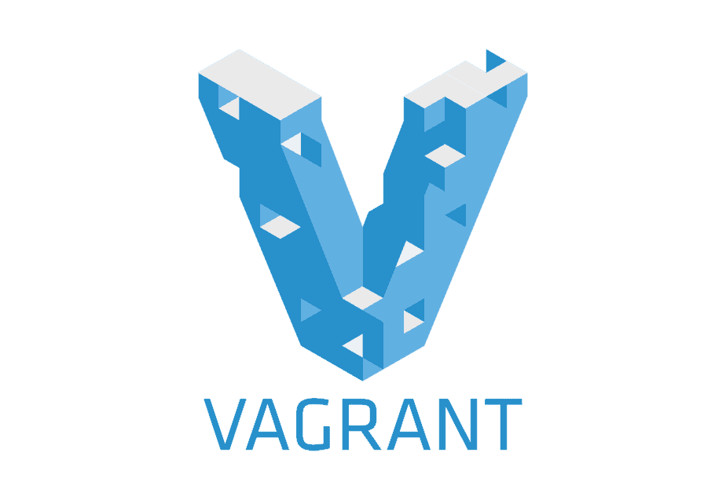

  

# Workshop 1

## 1. Instalar VirtualBox

  

## 2. Instalar Vagrant

  

## 3. Instalar Cmder (si esta en Windows)

  

## 4. Abrir la terminal

    vagrant init debian/bullseye64

## 5. Cambiar la IP de private_network a 192.168.56.10

    vagrant up

## 6. Conectarse a la instancia

    vagrant ssh

    OR

    eval "$(ssh-agent -s)"

    ssh-add .vagrant/machines/default/virtualbox/private_key
    
    ssh vagrant@192.168.56.10

## 7. Crear el tar.gz del Workshop

    cd ..

    tar cvfz Workshop01-Jose-Ali.tar.gz Workshop01

## 8. Desconectarse y apagar la maquina virtual

    exit

    vagrant halt