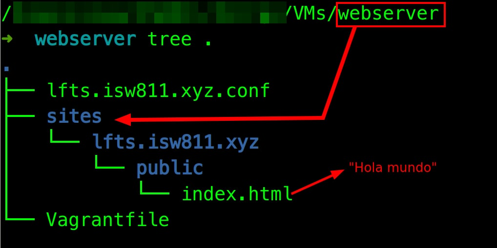

  

[<- Volver](./README.md)

## 1. Crear estos archivos en la maquina anfitriona

    mkdir -p sites/lfts.isw811.xyz/public
    touch sites/lfts.isw811.xyz/public/index.php
    echo "<h1>Hola</h1>" > sites/lfts.isw811.xyz/public/index.php

<!--  -->

  

## 2. Modificar el Vagrantfile

    config.vm.synced_folder "sites/", "/home/vagrant/sites", owner: "www-data", group: "www-data"

## 3. Reiniciar la maquina virtual

    vagrant halt
    
    vagrant up

## 4. Crear este archivo en la maquina anfitriona

    touch lfts.isw811.xyz.conf

## 5. Pegar esto dentro

        <VirtualHost *:80>
    ServerAdmin webmaster@lfts.isw811.xyz
    ServerName lfts.isw811.xyz

    # Indexes + Directory Root.
    DirectoryIndex index.php
    DocumentRoot /home/vagrant/sites/lfts.isw811.xyz/public

    <Directory /home/vagrant/sites/lfts.isw811.xyz/public>
        DirectoryIndex index.php
        AllowOverride All
        Require all granted
    </Directory>

    ErrorLog ${APACHE_LOG_DIR}/lfts.isw811.xyz.error.log

    # Possible values include: debug, info, notice, warn, error, crit,
    # alert, emerg.
    LogLevel warn

    CustomLog ${APACHE_LOG_DIR}/lfts.isw811.xyz.access.log combined
        </VirtualHost>

## 6. En la maquina virtual 
    
    sudo hostnamectl set-hostname webserver
    
    sudo nano /etc/hosts
    Cambiar bullseye a webserver    
    CTRL+O, ENTER, CTRL+X

    sudo cp vagrant/lfts.isw811.xyz.conf /etc/apache2/sites-available/
    sudo a2enmod vhost_alias rewrite ssl

    sudo nano /etc/apache2/apache2.conf
    ServerName webserver
    CTRL+O, ENTER, CTRL+X

    sudo apache2ctl -t
    sudo a2ensite vagrant/lfts.isw811.xyz.conf
    sudo systemctl reload apache2.service

## 7. Para sobreescribir el arhivo de VHOST, estando en la carpeta /vagrant de la máquina virtual:

    sudo cp lfts.isw811.xyz.conf /etc/apache2/sites-available/lfts.isw811.xyz.conf