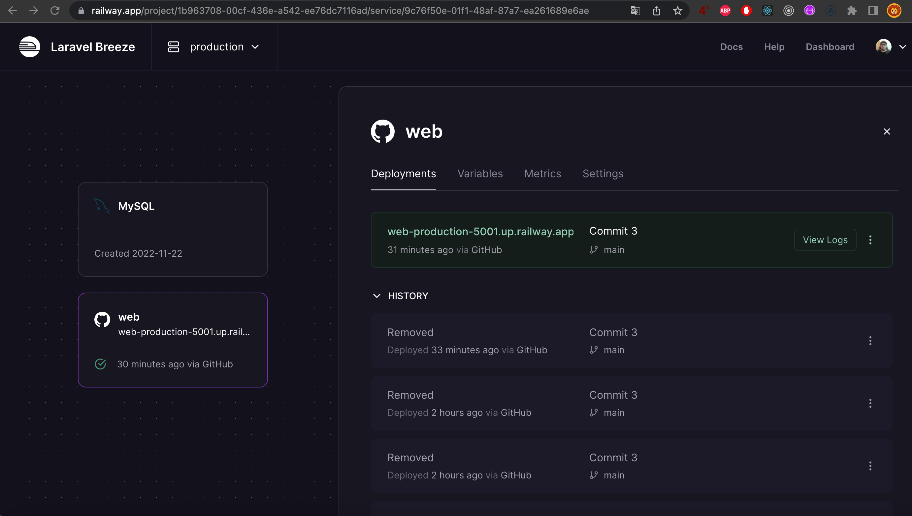

  

[<- Workshop 6](../Workshop06/README.md)

# Workshop 7: Crear proyecto de Laravel 9 con Docker y publicarlo en Railway

## 1. Crear el proyecto y levantarlo

    curl -s "https://laravel.build/laravel" | bash
    cd laravel
    code .
    alias sail='bash vendor/bin/sail'
    sail up 

## 2. Instalar Breeze

    sail composer require laravel/breeze --dev
    sail artisan breeze:install
    sail npm install
    sail npm run dev

## 3. Deploy Railway

    Actualizar PHP en composer.json a 8.1.0
    sail composer update
    sail npm run build
    Comentar "/public/build" del .gitignore

    Forzar https en app/Providers/AppServiceProvider.php boot, importar URL:
        use Illuminate\Support\Facades\URL;
        if($this->app->environment('production')){
            URL::forceScheme('https');
        }

    Agregar "protected $proxies = '*';" en app/Http/Middleware/TrustProxies.php

    Hacer push a GitHub:
        Crear el repositiorio laravel-breeze en GitHub
        git init
        git add .
        git commit -m "Commit 1"
        git remote add origin https://github.com/JoseAliRivasGomez/laravel-breeze.git
        git branch -M main
        git push -u origin main

    Crear Railway project (Deploy from GitHub repo)
    Crear MySQL DB en Railway
    Conectarse en Table Plus:
        DB_DATABASE=railway
        DB_HOST=containers-us-west-135.railway.app
        DB_PASSWORD=e4GiOHbsamoJdUgm6XRg
        DB_PORT=6159
        DB_USERNAME=root

    Agregar todas las variables de entorno de Laravel a Railway, modificar estas:
        APP_ENV=production
        APP_NAME=Laravel
        DB_CONNECTION=mysql
        DB_DATABASE=railway
        DB_HOST=containers-us-west-135.railway.app
        DB_PASSWORD=e4GiOHbsamoJdUgm6XRg
        DB_PORT=6159
        DB_USERNAME=root

    Esperar a que termine el primer Deploy

    Generar dominio

    Configurar Build Command en Railway settings y hacer otro Deploy:
        npm run build && php artisan optimize && php artisan migrate --force

